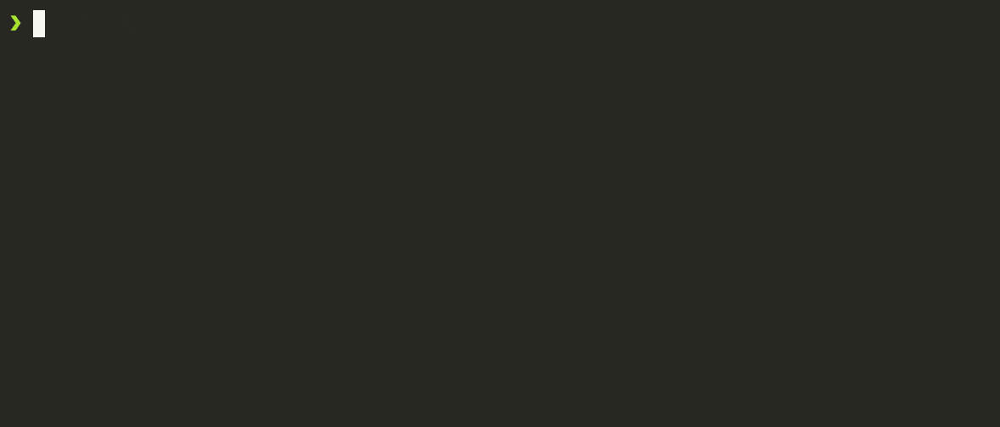

# [MapComponents MapLibre](https://mapcomponents.org/)

[](https://badge.fury.io/js/@mapcomponents%2Freact-maplibre) [](https://opensource.org/licenses/MIT)  


@mapcomponents/react-maplibre is a react component library for declarative GIS application development.
## Links

- Documentation: https://mapcomponents.github.io/react-map-components-maplibre/
- Catalogue: https://www.mapcomponents.org/

## Getting started

Use our Codesandbox template to quickly try out this library without any setup required. https://codesandbox.io/s/base-template-n0vp9

### **How to use @mapcomponents/react-maplibre in ...**

### **... a new project**

The easiest way to start a new project using this framework is to bootstrap a react application using our [vite-template](https://github.com/mapcomponents/template).

**Requirements:**

1. node.js >=16

Run the following commands in the terminal:

<!--@abc: exec() -->
```
npm create mapcomponents-app@latest myApp
cd myApp
npm i
npm run dev
```




This will start a development server that serves the mapcomponents app on port 5174 of your local machine as well as a browser tab with live reload enabled. This reloads the affected parts of the application if changes are detected to the corresponding files in the filesystem. Open the project folder in the IDE of your choice and start building your map client.


### **... an existing react project**

In this case, navigate to your project folder in a terminal and execute the following steps:

1. Add @mapcomponents/react-maplibre as a dependency to your project using `npm i @mapcomponents/react-maplibre`.
2. Add the MapComponentsProvider (named export of this module) to your applications react-DOM where it makes sense. Only children of this component will be able to render a map canvas or interact with a maplibre-gl instance. Place it in the index.js entrypoint if your application is a dedicated map app and all components have a high probability to interact with the maplibre-gl instance. Place it somewhere higher in the JSX tree if the map constitutes only a small portion of your app and components outside of the MapComponentsProvider have no need to interact with the map instance.
3. Add a MapLibreMap component to the react-DOM wherever the map canvas is supposed to be placed.

## Adding data to the map

The easiest way to add data to the map is using GeoJSON data and the MlGeoJsonLayer component. The MlGeoJsonLayer component is designed to require only the `geojson` property to be set, while it provides properties to fully customize it to your needs.

Insert the following code in your app below index.tsx to add a GeoJSON layer to your map.

```JSX
import MlGeoJsonLayer from '@mapcomponents/react-maplibre';

const geojson_data = {
	"type": "Feature",
	"properties": {},
	"geometry": {
		"coordinates": [
			[
				[0.7415817264899545, 56.91203727013931],
				[0.7743616447289128, 55.2757658775181],
				[4.609612078732766, 55.23840364745948],
				[4.642391996971725, 56.91203727013931],
				[0.7415817264899545, 56.91203727013931]
			]
		],
		"type": "Polygon"
	}
}
```

And add the following within the JSX.

```JSX
<MlGeoJsonLayer geojson={geojson_data} />
```


Please take a look at our storybooks and the code examples provided in the {ComponentName}.stories.tsx files next to the Components in the `./src/components/` folder.

## more links

- @mapcomponents/react-maplibre storybook: https://mapcomponents.github.io/react-map-components-maplibre
- @mapcomponents/react-maplibre-lab storybook: https://mapcomponents.github.io/react-map-components-maplibre-lab
